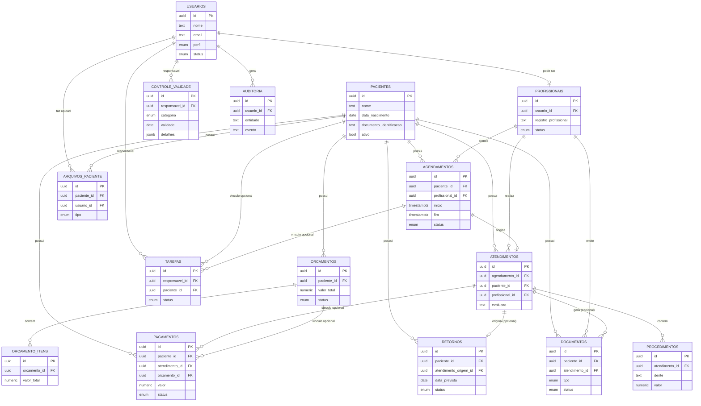

# Modelo de Dados

> Sprint 0: este documento descreve o modelo aprovado. **Nenhuma
> migration foi criada ainda** - isso e trabalho da Sprint 1 em diante,
> tabela por tabela, conforme cada modulo for implementado.

## Premissas

- Autenticacao via `auth.users` (Supabase); `public.usuarios` guarda o
  perfil de aplicacao em relacao 1:1 com `auth.users.id`.
- Perfis fixos (`administrador`, `dentista`, `recepcao`) como `ENUM`
  nesta fase.
- Nomes de tabela em portugues, snake_case.
- Tabelas ligadas a paciente usam exclusao logica; nunca `DELETE` fisico
  de prontuario (PAV-17).
- Campos de auditoria padrao: `created_at`, `updated_at`, `created_by`,
  `updated_by`.

## Tabelas (16)

`usuarios`, `profissionais`, `pacientes`, `agendamentos`, `atendimentos`,
`procedimentos`, `documentos`, `retornos`, `tarefas`, `pagamentos`,
`orcamentos`, `orcamento_itens`, `controle_validade`,
`arquivos_paciente`, `auditoria`.

Campos principais, PK/FK, constraints e indices: ver especificacao
tecnica aprovada (secao 5.2) - reproduzidos aqui de forma resumida com
os ajustes das decisoes PAV-09 a PAV-17:

- **pacientes.documento_identificacao**: nullable, sem validacao de
  formato (PAV-09).
- **pagamentos**: `atendimento_id` e `orcamento_id` nullable, com CHECK
  garantindo no maximo um dos dois preenchido (PAV-10).
- **orcamento_itens**: `descricao` texto livre + `quantidade` +
  `valor_unitario` + `valor_total`; sem FK para catalogo de
  procedimentos nesta fase (PAV-11).
- **controle_validade**: campo `categoria` (enum: material/
  esterilizacao) + `detalhes` (jsonb) para campos especificos de
  esterilizacao (lote, ciclo, responsavel tecnico) sem precisar de
  tabela separada (PAV-12).
- **agendamentos**: constraint de nao-overlap por profissional sem
  excecao de encaixe (PAV-13); a interface pode expor uma lista de
  "consultas a confirmar" para apoiar a confirmacao manual (PAV-14).
- **atendimentos.agendamento_id**: nullable - atendimento pode existir
  sem agendamento previo (PAV-15).
- **procedimentos.dente**: texto livre; convencao proposta FDI (PAV-16),
  pendente de confirmacao dos dentistas antes de uso em producao.
- **pacientes** e demais tabelas clinicas: sem exclusao fisica (PAV-17);
  usar `ativo=false`/status equivalente.
- **auditoria**: append-only - RLS deve impedir `UPDATE`/`DELETE` por
  qualquer perfil de aplicacao.

## ERD

## Proxima etapa

Migrations reais comecam na Sprint 1 (tabelas `usuarios`/`profissionais`
para autenticacao) e seguem incrementalmente por sprint, nunca todas de
uma vez.
