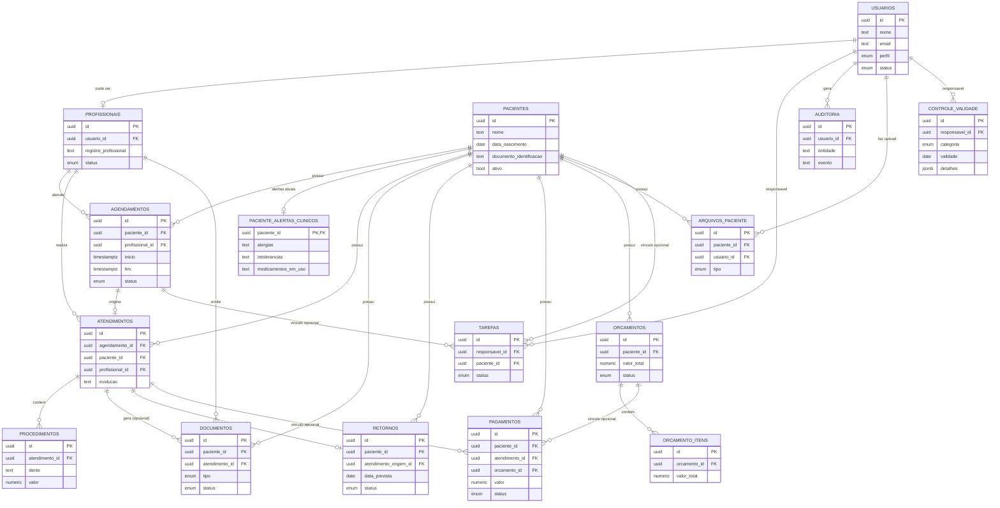

# Modelo de Dados

## Odontograma FDI (Sprint 14)

`0016_odontograma.sql` adiciona `procedimento_dentes`, relação 0..N entre um
procedimento e os 32 códigos FDI/ISO válidos da dentição permanente. A chave
única `(procedimento_id, dente_fdi)` impede duplicidade; o campo textual
`procedimentos.dente` permanece intacto para compatibilidade histórica.

`set_procedure_teeth()` substitui a seleção de forma idempotente e atômica,
somente pelo dentista ativo responsável e enquanto o atendimento está em
andamento. Dentes não alteram `quantidade`, `valor_aplicado_centavos`, snapshot
de materiais ou consumo do estoque. Superfícies, condições, diagnóstico e
odontograma infantil permanecem fora desta versão.

## Servicos e consumo de estoque (Sprint 13)

`0015_servicos_atendimento_estoque.sql` adiciona o catalogo administrativo
`servicos`, sua composicao em `servico_materiais` e o snapshot imutavel
`procedimento_materiais_consumo`. Procedimentos de catalogo guardam o
servico, a quantidade e o valor aplicado em centavos; procedimentos antigos
de texto livre continuam validos. A composicao e copiada no registro do
procedimento e nunca e recalculada a partir do catalogo depois disso.

`finalize_attendance()` le exclusivamente esse snapshot, bloqueia materiais
em ordem deterministica e registra a saida automatica junto da finalizacao.
Qualquer saldo insuficiente ou material inativo faz a transacao inteira falhar:
atendimento, agenda, saldo, movimentacoes e auditoria nao ficam parciais.

## Estoque (Sprint 12)

`0014_estoque.sql` adiciona `materiais_estoque` e `movimentacoes_estoque`.
O primeiro guarda somente o saldo atual e dados administrativos; o segundo e
o historico append-only de entrada, saida e ajuste, incluindo saldos
anterior/posterior. A quantidade nunca e alterada diretamente pela aplicacao.

As tabelas usam RLS. Clientes autenticados recebem somente `SELECT`
autorizado; `INSERT`, `UPDATE` e `DELETE` diretos sao revogados. As RPCs
transacionais bloqueiam a linha do material antes de atualizar o saldo, para
impedir saidas concorrentes de gerar estoque negativo.

> As migrations `0001`-`0016` estao alinhadas na homologacao ficticia. A
> `0016` foi aplicada via CLI após migration list/dry-run e o dry-run posterior
> confirmou o banco remoto atualizado.
> As migrations `0007` e `0008` sao historicas e foram preservadas sem
> reescrita. Todas as migrations aplicadas permanecem imutaveis.

## Premissas

- Autenticacao via `auth.users` (Supabase); `public.usuarios` guarda o
  perfil de aplicacao em relacao 1:1 com `auth.users.id`.
- Perfis fixos (`administrador`, `dentista`, `recepcao`) como `ENUM`
  nesta fase.
- Nomes de tabela em portugues, snake_case.
- Tabelas ligadas a paciente usam exclusao logica; nunca `DELETE` fisico
  de prontuario (PAV-17).
- Campos de auditoria padrao: `created_at`, `updated_at`, `created_by`,
  `updated_by`.

## Tabelas implementadas no main

`usuarios`, `profissionais`, `pacientes`, `paciente_alertas_clinicos`,
`agendamentos`, `atendimentos`,
`procedimentos`, `documentos`, `retornos`, `tarefas`, `arquivos_paciente`,
`auditoria`, `orcamentos`, `orcamento_itens`, `pagamentos`, `materiais_estoque`,
`movimentacoes_estoque`, `servicos`, `servico_materiais`,
`procedimento_materiais_consumo` e `procedimento_dentes`.

`controle_validade` existe nas migrations historicas `0007` e `0008`, mas o
modulo de validade/esterilizacao continua fora da homologacao operacional.

## Orcamentos (migration 0011)

- `orcamentos`: numero sequencial interno unico, paciente, profissional,
  data, validade opcional em rascunho, observacao administrativa, status e
  total em centavos. O total e derivado exclusivamente dos itens ativos.
- `orcamento_itens`: descricao livre, quantidade, valor unitario em centavos,
  total gerado e `ativo` para remocao logica. Nao existe catalogo de
  procedimentos nesta fase.
- Status: `rascunho -> enviado -> aprovado|rejeitado`; somente aprovado pode
  virar `convertido`. Enviado cuja validade ja passou e tratado como
  `expirado` no servidor e nao pode ser aprovado. `convertido` e marcador
  comercial, sem criar atendimento, procedimento ou pagamento.
- Escrita direta e `DELETE` sao revogados para usuarios autenticados. As
  mutacoes passam pelas RPCs transacionais de criacao, edicao, itens e status.

## Pagamentos (migrations 0012 e 0013)

- `pagamentos` guarda somente valores inteiros em centavos, paciente
  obrigatorio, forma, data, status e observacao administrativa curta.
- Um pagamento referencia no maximo um de `atendimento_id` ou `orcamento_id`;
  tambem pode ficar somente vinculado ao paciente (PAV-10).
- Novos pagamentos nascem `pago`; valor, forma, data e vinculo sao imutaveis.
  Correcao operacional ocorre somente por `cancelado` ou `estornado`, ambos
  preservando o registro para historico e auditoria.
- Indices atendem a paginação/filtros por paciente e data. Indices parciais
  impedem dois pagamentos `pago` para o mesmo atendimento ou orçamento nesta
  fase sem parcelamento.
- A `0013` remove assinaturas legadas do WIP que permitiam editar pagamentos;
  nao altera migrations anteriores nem dados de producao.

## Tarefas (migrations 0009 e 0010)

- `prioridade`: enum com `baixa`, `media`, `alta` e `urgente`, obrigatoria e
  com default `media`, preservando tarefas preexistentes.
- `removida_em` e `removida_por`: remocao logica consistente por constraint;
  a policy e as queries excluem tarefas removidas da listagem normal.
- `status_tarefa`: inclui `pendente`, `em_andamento`, `concluida` e
  `cancelada`. Transicoes e autorizacao continuam exclusivamente na RPC
  `set_task_status`.
- A assinatura anterior de `create_task` foi mantida para clientes em
  transicao; ela usa o default de prioridade sem expor privilegios adicionais.

Campos principais, PK/FK, constraints e indices: ver especificacao
tecnica aprovada (secao 5.2) - reproduzidos aqui de forma resumida com
os ajustes das decisoes PAV-09 a PAV-17:

- **pacientes.documento_identificacao**: nullable, sem validacao de
  formato (PAV-09).
- **pacientes.telefone_contato**: nullable e em formato livre; uma coluna
  gerada somente com digitos apoia a busca sem alterar a apresentacao.
- **paciente_alertas_clinicos**: relacao 1:1 com `pacientes`; alergias,
  intolerancias e medicamentos em uso representam apenas o estado atual.
  O acesso e exclusivo de dentista ativo com vinculo profissional ativo.
  Administrador puro e recepcao nao recebem essas colunas.
- **pagamentos**: `atendimento_id` e `orcamento_id` nullable, com CHECK
  garantindo no maximo um dos dois preenchido (PAV-10).
- **orcamento_itens**: `descricao` texto livre + `quantidade` +
  `valor_unitario` + `valor_total`; sem FK para catalogo de
  procedimentos nesta fase (PAV-11).
- **controle_validade**: campo `categoria` (enum: material/
  esterilizacao) + `detalhes` (jsonb) para campos especificos de
  esterilizacao (lote, ciclo, responsavel tecnico) sem precisar de
  tabela separada (PAV-12).
- **agendamentos**: constraint de nao-overlap por profissional sem
  excecao de encaixe (PAV-13); a interface pode expor uma lista de
  "consultas a confirmar" para apoiar a confirmacao manual (PAV-14).
- **atendimentos.agendamento_id**: nullable - atendimento pode existir
  sem agendamento previo (PAV-15).
- **procedimentos.dente**: texto livre; convencao proposta FDI (PAV-16),
  preservado como legado. A seleção estruturada FDI usa
  `procedimento_dentes` e não tenta interpretar esse texto.
- **pacientes** e demais tabelas clinicas: sem exclusao fisica (PAV-17);
  usar `ativo=false`/status equivalente.
- **auditoria**: append-only - RLS deve impedir `UPDATE`/`DELETE` por
  qualquer perfil de aplicacao.

## Modelo implementado no bloco clinico

- `agendamentos`: paciente/profissional, `inicio`/`fim` em `timestamptz`,
  status fechado e observacao exclusivamente administrativa. Exclusion
  constraint GiST em `[inicio,fim)` bloqueia concorrencia para estados
  agendado/confirmado/atendido; cancelado e falta preservam o registro e
  liberam o intervalo.
- `atendimentos`: paciente/profissional, agendamento opcional, estado
  `em_andamento|finalizado`, evolucao sensivel e timestamps. Um agendamento
  origina no maximo um atendimento. Atendimento finalizado e imutavel.
- `procedimentos`: pertence ao atendimento; descricao, dente/regiao em texto
  livre, material, cor e detalhes opcionais. Para catalogo, referencia
  `servico_id`, quantidade e valor aplicado em centavos; o consumo fica no
  snapshot separado. So pode mudar enquanto o atendimento estiver em andamento;
  nenhuma exclusao fisica pela aplicacao.
- Indices cobrem agenda por inicio/profissional/paciente, historico de
  atendimento por paciente/profissional e procedimentos por atendimento.
- Escritas diretas e `DELETE` estao revogados. RPCs fazem autorizacao,
  validacao, auditoria e transicoes atomicas.

## ERD

## RLS e consistencia (Sprint 1.5)

`usuarios` e `profissionais` tem RLS habilitada desde a criacao (nunca
existiu um momento em que essas tabelas ficaram sem RLS). Padrao usado:

- Funcoes `public.is_admin()` e `public.is_active_user()` (`SECURITY
  DEFINER`, `search_path = ''`) para permitir que
  policies de `usuarios` verifiquem o perfil do usuario logado sem cair
  em recursao de avaliacao de RLS (a policy nao pode consultar
  diretamente a propria tabela que ela protege).
- `usuarios`: SELECT proprio para autenticado e SELECT geral para admin.
  Sem `INSERT/UPDATE/DELETE` direto para `authenticated`; alteracao passa
  por `update_user_access()`, que protege o ultimo admin e audita.
- `profissionais`: SELECT apenas para usuario ativo. Escritas diretas de
  usuario foram revogadas; a RPC sincroniza perfil/status.
- Trigger em `auth.users` provisiona convite em uma unica transacao e
  sincroniza alteracao de e-mail. A migration recusa contas Auth
  preexistentes sem perfil para impedir saneamento silencioso.
- `auditoria`: append-only; somente admin le, usuario autenticado nao
  escreve nem altera. Indices cobrem usuario/tempo e entidade/tempo.

Ver `docs/SECURITY.md` para o racional completo.

## Estado de validacao

`0001`-`0015`, lint SQL e as suites RLS/RPC sao validados exclusivamente na
homologacao ficticia. As migrations historicas permanecem imutaveis.
